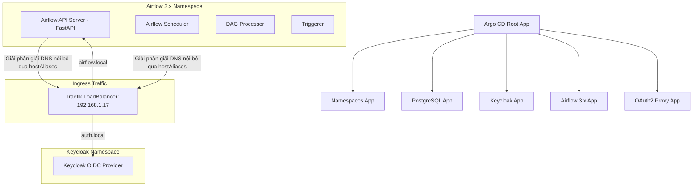

# Sentiment Pulse - Platform GitOps Blueprint

Tài liệu này hướng dẫn chi tiết về kiến trúc GitOps, cấu trúc thư mục, quy trình triển khai và cấu hình tích hợp SSO cho toàn bộ nền tảng **Sentiment Pulse** sử dụng Kubernetes, Argo CD, Airflow 3.x, Keycloak và PostgreSQL.

---

## 🗺️ Sơ đồ Kiến trúc & Mạng (Network & SSO Flow)

Nền tảng sử dụng mô hình **App-of-Apps** của Argo CD để quản lý vòng đời ứng dụng và cấu hình tập trung.



---

## 📂 Cấu trúc thư mục (Directory Structure)

Thư mục `platform-gitops/` được tổ chức như sau:

*   **`bootstrap/`**:
    *   `root-app.yaml`: Application gốc (Root App) quản lý và tự động triển khai tất cả các ứng dụng con trong thư mục `apps/`.
*   **`apps/`**:
    *   Chứa các tài nguyên định nghĩa Argo CD Application cho từng dịch vụ: `namespaces.yaml`, `postgres.yaml`, `keycloak.yaml`, `airflow.yaml`, `oauth2-proxy.yaml`, và các cấu hình ingress tương ứng.
*   **`helm-values/`**:
    *   `airflow-values.yaml`: Tham số cấu hình cho Apache Airflow (tối ưu hóa cho Airflow 3.x).
    *   `keycloak-values.yaml`: Tham số cấu hình cho Keycloak Identity Provider.
    *   `oauth2-proxy-values.yaml`: Cấu hình cho OAuth2 Proxy bảo vệ cổng API/UI.
*   **`manifests/`**:
    *   Chứa các tài nguyên Kubernetes thô (Raw Manifests) như Ingress định tuyến (`argocd-ingress.yaml`, `keycloak-ingress.yaml`) và định nghĩa namespace (`namespaces.yaml`).

---

## 🛠️ Triển khai và Khởi chạy (Bootstrapping Guide)

Để khởi chạy toàn bộ hệ thống từ đầu trên cụm Kubernetes của bạn, chạy lệnh duy nhất sau:

```bash
kubectl apply -f platform-gitops/bootstrap/root-app.yaml
```

Argo CD sẽ tự động quét thư mục `apps/`, tạo các namespace cần thiết, thiết lập cơ sở dữ liệu Postgres, khởi tạo Keycloak, cài đặt Airflow và định tuyến lưu lượng qua Traefik Ingress.

---

## 🔐 Cấu hình Đăng nhập một lần (SSO / OIDC Authentication)

Airflow 3.x sử dụng **FastAPI API Server** làm cổng giao tiếp chính. Hệ thống được bảo mật bằng **FAB Auth Manager (Keycloak OIDC Provider)**.

### Giải pháp Phân giải DNS nội bộ (Internal DNS Resolution)
Do Keycloak sử dụng tên miền bên ngoài là `auth.local`, các container bên trong cluster (như `apiServer` và `scheduler`) khi khởi chạy sẽ gọi đến đầu cuối `http://auth.local/realms/...` để lấy khóa công khai (JWKs) nhằm xác thực JWT Token. 

Vì DNS nội bộ (`kube-dns`) không tự phân giải được tên miền này, chúng ta sử dụng cấu hình **`hostAliases`** trỏ trực tiếp về IP của Ingress Controller:

```yaml
# Cấu hình trong airflow-values.yaml
apiServer:
  hostAliases:
    - ip: "192.168.1.17"  # Traefik LoadBalancer IP
      hostnames:
        - "auth.local"

scheduler:
  hostAliases:
    - ip: "192.168.1.17"
      hostnames:
        - "auth.local"
```

---

## ⚡ Các Tùy chỉnh Tối ưu hóa Hiệu năng (Performance Tuning)

Để chạy ổn định trên môi trường máy ảo (VM) có tài nguyên CPU/RAM hạn chế:

1.  **Tăng Probe Timeout**: Do hệ thống khởi động Python và kết nối DB trên VM mất nhiều thời gian, toàn bộ Probe (`startupProbe`, `livenessProbe`) của Airflow được nâng lên **180 giây** nhằm tránh việc Kubernetes kill container quá sớm.
2.  **Tối ưu Worker của API Server**:
    *   Giảm số lượng API Server Workers xuống **`1`** (`AIRFLOW__API_SERVER__WORKERS: "1"`) để giảm lượng CPU khởi tạo ban đầu, bảo toàn tài nguyên cho Scheduler và DAG Processor.
3.  **Tăng giới hạn Tài nguyên**:
    *   Các pod `scheduler`, `apiServer`, `dagProcessor`, và `triggerer` đều được đặt giới hạn RAM ở mức tối thiểu **`1024Mi` (1Gi)** nhằm triệt tiêu lỗi `OOMKilled`.

---

## 🖥️ Một số lệnh Vận hành nhanh (Operations Cheat Sheet)

### Xem trạng thái đồng bộ của Argo CD App:
```bash
kubectl get app airflow -n argocd
```

### Ép buộc Argo CD làm mới cấu hình từ Git (Hard Refresh):
```bash
kubectl annotate app airflow -n argocd argocd.argoproj.io/refresh=hard --overwrite
```

### Xem log khởi động của API Server:
```bash
kubectl logs deploy/airflow-api-server -c api-server -n airflow -f
```

### Kích hoạt lại tính năng tự động đồng bộ (Self-Heal):
```bash
kubectl patch app root-app -n argocd --type merge -p '{"spec":{"syncPolicy":{"automated":{"prune":true,"selfHeal":true}}}}'
kubectl patch app airflow -n argocd --type merge -p '{"spec":{"syncPolicy":{"automated":{"prune":true,"selfHeal":true}}}}'
```