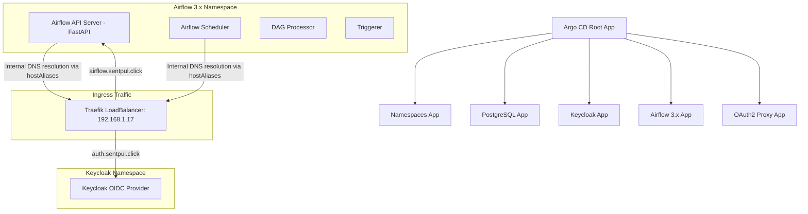

# Sentiment Pulse - Platform GitOps Blueprint

This document provides detailed instructions on the GitOps architecture, folder structure, deployment workflow, and SSO integration configuration for the entire **Sentiment Pulse** platform using Kubernetes, Argo CD, Airflow 3.x, Keycloak, and PostgreSQL.

---

## 🗺️ Architectural & Network Diagram (Network & SSO Flow)

The platform utilizes Argo CD's **App-of-Apps** pattern to manage application lifecycles and centralized configuration.



---

## 📂 Directory Structure

The `platform-gitops/` directory is organized as follows:

*   **`bootstrap/`**:
    *   `root-app.yaml`: Root application (Root App) that manages and automatically deploys all child applications inside the `apps/` directory.
*   **`apps/`**:
    *   Contains Argo CD Application resource definitions for each service: `namespaces.yaml`, `postgres.yaml`, `keycloak.yaml`, `airflow.yaml`, `oauth2-proxy.yaml`, and their corresponding ingress configurations.
*   **`helm-values/`**:
    *   `airflow-values.yaml`: Configuration values for Apache Airflow (optimized for Airflow 3.x).
    *   `keycloak-values.yaml`: Configuration values for Keycloak Identity Provider.
    *   `oauth2-proxy-values.yaml`: Configuration values for OAuth2 Proxy protecting API/UI endpoints.
*   **`manifests/`**:
    *   Contains raw Kubernetes manifests such as routing ingresses (`argocd-ingress.yaml`, `keycloak-ingress.yaml`) and namespace definitions (`namespaces.yaml`).

---

## 🛠️ Bootstrapping Guide

To boot up the entire system from scratch on your Kubernetes cluster, run the following single command:

```bash
kubectl apply -f platform-gitops/bootstrap/root-app.yaml
```

Argo CD will automatically scan the `apps/` directory, create necessary namespaces, set up the Postgres database, initialize Keycloak, install Airflow, and route traffic via Traefik Ingress.

---

## 🔐 Single Sign-On Configuration (SSO / OIDC Authentication)

Airflow 3.x utilizes the **FastAPI API Server** as its primary communication interface. The system is secured using **FAB Auth Manager (Keycloak OIDC Provider)**.

### Internal DNS Resolution Solution
Since Keycloak uses the external domain name `auth.sentpul.click`, containers inside the cluster (such as `apiServer` and `scheduler`) will call the endpoint `http://auth.sentpul.click/realms/...` to retrieve the public keys (JWKs) for JWT token validation upon startup.

Because the internal DNS (`kube-dns`) cannot resolve this domain directly, we use the **`hostAliases`** configuration to point directly to the IP address of the Ingress Controller:

```yaml
# Configuration in airflow-values.yaml
apiServer:
  hostAliases:
    - ip: "192.168.1.17"  # Traefik LoadBalancer IP
      hostnames:
        - "auth.sentpul.click"

scheduler:
  hostAliases:
    - ip: "192.168.1.17"
      hostnames:
        - "auth.sentpul.click"
```

---

## 🎡 Kafka Cluster & Ecosystem (Kafka Ecosystem)

The system integrates a minimal Kafka cluster alongside administrative and Schema Contract management tools:

1. **Kafka (KRaft Mode)**:
   - Deployed using Bitnami Helm chart in KRaft mode (no ZooKeeper required) to optimize RAM and CPU resource consumption of the virtual machine.
   - Namespace: `kafka`
   - Service: `kafka.kafka.svc.cluster.local:9092`
2. **Kafka UI**:
   - Intuitive web administration UI for the Kafka cluster to monitor Topics, Messages, and Consumer Groups.
   - Service: `kafka-ui.kafka.svc.cluster.local` (port 80)
3. **Apicurio Registry (Schema Registry)**:
   - Stores and manages Schema Contracts (Avro, JSON Schema). Uses a lightweight in-memory storage version.
   - Service: `apicurio.kafka.svc.cluster.local` (port 80)

---

## 🖥️ Operations Cheat Sheet

### View Argo CD App sync status:
```bash
kubectl get app airflow -n argocd
```

### Force Argo CD to reload config from Git (Hard Refresh):
```bash
kubectl annotate app airflow -n argocd argocd.argoproj.io/refresh=hard --overwrite
```

### View API Server startup logs:
```bash
kubectl logs deploy/airflow-api-server -c api-server -n airflow -f
```

### Re-enable auto-sync (Self-Heal):
```bash
kubectl patch app root-app -n argocd --type merge -p '{"spec":{"syncPolicy":{"automated":{"prune":true,"selfHeal":true}}}}'
kubectl patch app airflow -n argocd --type merge -p '{"spec":{"syncPolicy":{"automated":{"prune":true,"selfHeal":true}}}}'
```