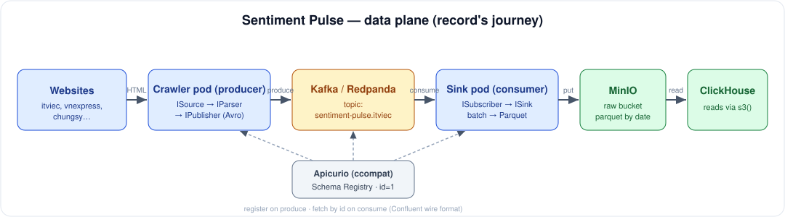
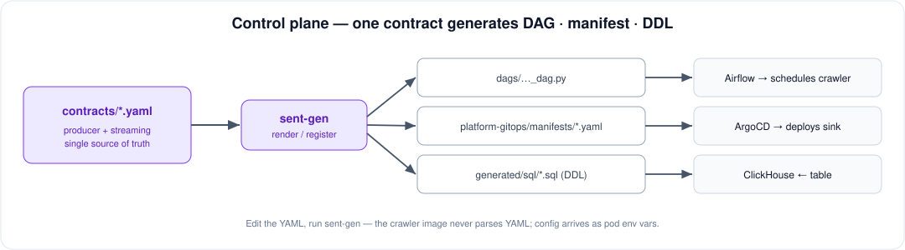

# Sentiment Pulse

A self-hosted data platform that **crawls Vietnamese job / news / community sites**,
streams the records through **Kafka**, lands them as **Parquet on MinIO**, and serves
them from **ClickHouse** — all generated from one YAML contract per source and
deployed by GitOps onto a single node.

The design goal is **cheap to extend, honest about scale**: adding a source or a
sink is a small adapter behind a port; the real scaling limits are operational
(partitions, batch size, node size), not the code.

## Data plane — how a record moves



1. **Crawler pod (producer).** A per-source job (`api_crawler/jobs/<name>/`) fetches
   listing + detail pages (`curl_cffi` to pass Cloudflare), parses HTML into record
   dicts, Avro-encodes them, and produces to a Kafka topic. Wiring is Clean
   Architecture: `ISource → IParser → IPublisher`, assembled only in the job's
   `__main__.py`.
2. **Kafka / Redpanda.** One topic per source (`sentiment-pulse.<source>`). Redpanda
   is a drop-in Kafka-API broker used for local testing; production uses Kafka. Same
   image, same client — only the broker address (an env var) changes.
3. **Schema Registry (Apicurio, ccompat).** The producer registers the Avro schema
   once and embeds its id in every message (Confluent wire format:
   `[0x00][schema_id][avro]`). The consumer fetches the writer schema by id, so
   schemas can evolve without redeploying the sink.
4. **Sink pod (consumer).** A generic, env-driven worker (`api_crawler/sink/`) reads
   the topic, buffers records, and flushes date-partitioned **Parquet** to MinIO.
   Same Clean Architecture, mirrored: `ISubscriber → ISink`.
5. **MinIO → ClickHouse.** Parquet lands under `raw/<source>/dt=YYYY-MM-DD/…`.
   ClickHouse reads it with the `s3()` table function — MinIO is the raw landing
   zone (data lake), ClickHouse is the query layer.

Delivery is **at-least-once**: the sink commits Kafka offsets only after a batch is
durably written. A crash may re-deliver the last batch (duplicate Parquet rows) —
acceptable for a raw landing zone.

## Control plane — one contract, generated everything



Each source is described by **one YAML contract** in `data-contracts/contracts/`.
`sent-gen` renders it into the Airflow DAG (schedules the crawler), the k8s
manifests (the sink Deployment + ArgoCD app), and the ClickHouse DDL. Config flows
**one way**: YAML → `sent-gen` → pod env vars → the app reads env. The crawler and
sink images never parse YAML, so they carry no coupling to this repo's layout.

## The seams (why extending is cheap)

The pipelines depend only on ports (zero-dependency ABCs), never on concrete
adapters — so each of these is a small, isolated add:

- **New source** → implement `ISource` + `IParser`, reuse `CrawlService` +
  `AvroKafkaProducer`. See `api_crawler/README.md`.
- **New topic to archive** → a new streaming contract; the generic sink is reused
  as-is (only env differs).
- **New sink store** (e.g. GCS alongside MinIO) → a new `ISink` adapter, selected
  by env in the sink's composition root. `ISink` is already the seam, so this needs
  **no change** to the pipeline, ports, or consumer. We deliberately keep a single
  `MinioSink` today and would only extract a shared `IObjectStore` once a second
  backend actually exists — not before (avoiding speculative generality).

## Scale levers (honest limits)

The code scales; the **single 16 GB node is the real ceiling**. What to turn when
volume grows:

- **Topic partitions.** A topic with 1 partition caps the sink at 1 effective
  consumer no matter how many replicas. Raise partitions first, then `replicas`
  (≤ partition count), to scale horizontally via consumer groups.
- **Batch size** (`BATCH_MAX_RECORDS` / `BATCH_MAX_SECONDS`). Small flushes create
  many small Parquet files, which slow ClickHouse `s3()` scans. Raise the batch (or
  add a compaction job) as throughput grows.
- **Consumer groups.** Two sinks on the same topic with different `KAFKA_GROUP_ID`
  read the stream independently — the decoupled way to fan out to a second store.
- **Infra HA.** Kafka is 1 broker, MinIO is 1 replica (not distributed) — no HA on
  one node. That's a cluster concern, not a code one.

## Repository layout

- **`api_crawler/`** — crawler (producer) + generic sink (consumer). Clean
  Architecture; the only image. See `api_crawler/README.md`.
- **`data-contracts/`** — `sent-gen` generator, contracts, Avro schemas, generated
  DDL. See `data-contracts/README.md`.
- **`platform-gitops/`** — ArgoCD app-of-apps: manifests + apps for MinIO, Kafka,
  ClickHouse, Keycloak, Airflow, the sinks, etc.
- **`dags/`** — generated Airflow DAGs (DO NOT EDIT — edit the contract).
- **`images/`** — diagrams used in this README.

## Local end-to-end (Redpanda + MinIO)

```bash
# broker + schema registry
docker run -d --name redpanda -p 9092:9092 -p 8081:8081 \
  redpandadata/redpanda redpanda start --mode dev-container
# object store
docker run -d --name minio -p 9000:9000 -p 9001:9001 \
  -e MINIO_ROOT_USER=minioadmin -e MINIO_ROOT_PASSWORD=minioadminpassword \
  minio/minio server /data --console-address :9001

docker build -t ghcr.io/khaidao2/sentiment-pulse-crawler:latest .

# crawl -> Kafka
docker run --rm --network host \
  -e KAFKA_BOOTSTRAP_SERVERS=localhost:9092 -e SCHEMA_REGISTRY_URL=http://localhost:8081 \
  -e MAX_PAGES=1 ghcr.io/khaidao2/sentiment-pulse-crawler:latest

# Kafka -> MinIO Parquet
docker run --rm --network host \
  -e KAFKA_BOOTSTRAP_SERVERS=localhost:9092 -e SCHEMA_REGISTRY_URL=http://localhost:8081 \
  -e MINIO_ENDPOINT=http://localhost:9000 -e MINIO_ACCESS_KEY=minioadmin \
  -e MINIO_SECRET_KEY=minioadminpassword -e BATCH_MAX_SECONDS=5 \
  ghcr.io/khaidao2/sentiment-pulse-crawler:latest python -m api_crawler.sink
```

Details and per-component instructions live in `api_crawler/README.md` and
`data-contracts/README.md`.
