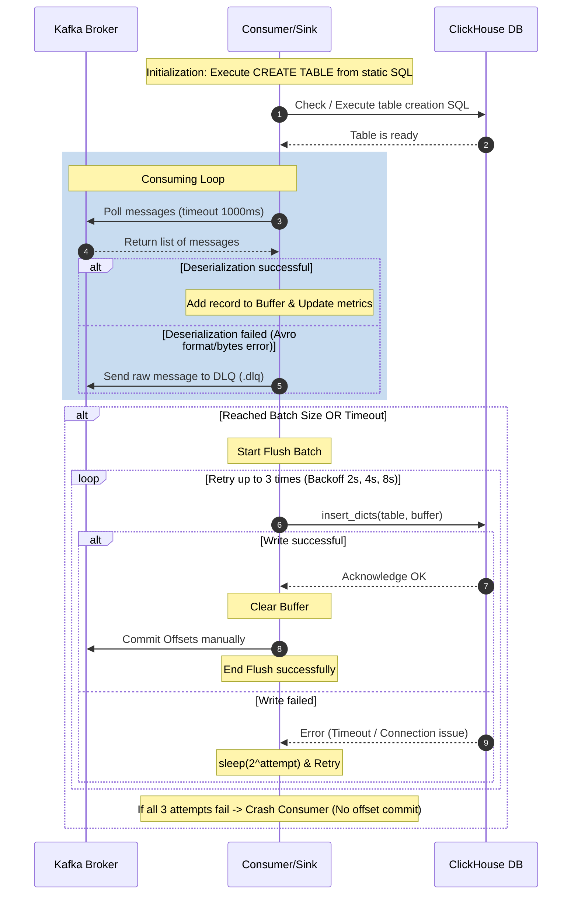

# Sentiment Pulse Data Ingestion System Architecture

This document describes in detail the architecture of the Data Ingestion Pipeline of the **Sentiment Pulse** project. The system is designed to be GitOps-ready, ensuring high scalability, resilience, optimized write performance for ClickHouse, and strict schema management via a Schema Registry.

---

## 1. Architecture Diagram

The diagram below represents the end-to-end flow of data from the source (Crawler) through Kafka (Redpanda) to its final, optimized storage in ClickHouse, alongside the control and Schema management flows driven by the `sent-gen` CLI:

```mermaid
flowchart TD
    subgraph GitOps_CLI [Administration & Code Generation - sent-gen]
        YAML[data-contracts/infra/*.yaml] -->|Read Config| CLI[sent-gen CLI]
        AVSC[data-contracts/schemas/*.avsc] -->|Read Avro Schema| CLI
        CLI -->|Generate Table & Save| SQL[data-contracts/schemas/*.sql]
        SQL -->|Statically Inject Into| SinkTemplate[clickhouse_sink.py.jinja]
        CLI -->|1. Register Schema| Apicurio[Apicurio Registry]
        CLI -->|2. Generate Python Code| GeneratedFiles[api_crawler/ & dags/]
    end

    subgraph Data_Pipeline [Run-time Data Flow]
        Airflow[Airflow DAG] -->|Periodically Trigger| Crawler[API Crawler]
        Crawler -->|Send Python Dict| Producer[Kafka Producer Class]
        Producer -->|Avro Validate & Schemaless Serialize| Producer
        Producer -->|Push Binary Data| Kafka[Kafka / Redpanda Broker]
        
        Kafka -->|Poll Message Batch| Sink[Kafka Sink Consumer]
        Sink -->|Schemaless Deserialize| Sink
        Sink -->|Accumulate in Buffer| Sink
        Sink -->|Reached Batch Size / Timeout| Sink
        
        Sink -->|Write Large Batch - Batch Ingestion| ClickHouse[(ClickHouse Database)]
        ClickHouse -->|Write Successful| Sink
        Sink -->|Manual Offset Commit| Kafka
    end

    subgraph ClickHouse_Init [Table Initialization]
        Sink -->|First Run - Execute Static SQL| ClickHouse
    end
```

---

## 2. System Component Details

### 2.1. Data Contract Management & the `sent-gen` CLI Tool
The system uses the **Schema-as-Code** philosophy. Every data source is described by a set of configuration files:
- **Avro Schema (`.avsc`)**: Defines the structure, data types, and required/nullable fields of the messages.
- **Contract YAML**: Defines infrastructure information (Kafka topic, ClickHouse host/port/database/table, Airflow DAG schedule, and output path for generated code).
- **CLI Tool (`sent-gen`)**: Acts as a compiler:
  - Automates registering schemas to the Apicurio Registry for sharing schemas with other services in the K3s cluster.
  - Automates generating Python source code (`producer.py`, `sink.py`, `dag.py`) so developers can simply import and use the generated classes without dealing with complex connection and serialization/deserialization logic.

### 2.2. Kafka Producer
- Packages data and publishes it to the message queue.
- Performs **Avro validation** before sending to prevent bad data at the source, protecting downstream consumers from crashing due to malformed payloads.
- Uses **Schemaless Avro Binary Serialization**: removes schema metadata from each published message payload (only raw binary data is sent), drastically reducing network bandwidth and storage overhead on Kafka.

### 2.3. Kafka Sink (Consumer) & ClickHouse Ingestion
Specifically optimized for ClickHouse (columnar database) with production-ready patterns:
- **Manual Offset Commit (`enable_auto_commit=False`)**: Disables Kafka's default auto-commit mechanism to prevent data loss. Message offsets are only committed to the Kafka broker after ClickHouse successfully acknowledges writing the batch to disk.
- **Batching & Buffering**: Accumulates messages in an ingestion buffer and writes them in batches (`insert_dicts`) when the batch size limit is met (e.g., 1000 records) or after a timeout (e.g., 5 seconds). This avoids the severe ClickHouse **"Too many parts"** error caused by continuous tiny writes.
- **Static SQL Database Table Initialization**: Rather than dynamically mapping tables at runtime via Python code (which makes infrastructure management difficult), the CLI generates a static SQL file (`.sql`) on the first render. This file is directly loaded by the Sink class to verify and create the table. Users can customize storage engines (e.g., changing from `MergeTree` to `ReplacingMergeTree`, partitioning keys, or custom sorting indexes) directly in the static SQL file without fear of it being overwritten on subsequent renders.

---

## 3. Practical Production Safety Features

The system implements advanced safety patterns to ensure reliable operations under production loads:

| Production Issue | Technical Solution | System Operation Mechanism |
| :--- | :--- | :--- |
| **Data loss due to processing errors or database write failures** | `enable_auto_commit=False` & Manual Offset Commit | Only call `consumer.commit()` **immediately after** `ch_client.insert_dicts(...)` successfully returns without error. If ClickHouse goes down, the offset remains uncommitted, and the consumer will read the batch again upon restart. |
| **ClickHouse bottlenecks / freezes due to too many parts** | Batching & Flush Timeout | Accumulate data in the `buffer`. Trigger flush when `len(buffer) >= batch_size` OR when the elapsed time since the last flush exceeds `batch_timeout_ms`. |
| **Consumer Out of Memory (OOM) during large Kafka consumer lag** | Bounded Buffer Size Limit (`max_buffer_size = 100000`) | Set a hard limit on the buffer size. If the buffer exceeds this limit, force an immediate flush before polling new messages. |
| **Transient ClickHouse connection dropouts / overloads** | Retry Loop with Exponential Backoff | If a flush fails, the consumer does not crash immediately. It retries up to 3 times with increasing backoffs (2s, 4s, 8s). If it fails after 3 attempts, it crashes to trigger system alerts (Kubernetes restart) without committing offsets. |
| **High CPU usage on the Consumer** | Remove redundant runtime validation | Remove `fastavro.validate` calls from the polling loop. Schemaless deserialization acts as a natural validation step; malformed payloads will fail deserialization and raise errors. |
| **Difficulty optimizing and tweaking database schemas** | Auto-generate & Preserve Static SQL | The `.sql` schema file is generated dynamically only if it does not exist. If it exists, the CLI preserves it, allowing DB Engineers to customize storage engines, sorting keys, partition schemas, or TTLs. |
| **Malformed/corrupted messages blocking the pipeline or silent loss** | Dead Letter Queue (DLQ) | When deserialization fails, the consumer routes the raw bytes of the malformed message to a `{topic}.dlq` topic using an independent `KafkaProducer` and commits the offset to keep the pipeline moving. |
| **Missing real-time monitoring and alerting** | Integrate Prometheus Metrics Server | Automatically starts an HTTP server on `METRICS_PORT` (default 8000) using the `prometheus-client` library, exposing key metrics such as throughput, buffer size, flush durations, and write errors. |

---

## 4. Detailed Ingestion Sequence Diagram

The sequence diagram below displays the detailed process of the Consumer polling, processing, and committing offsets:

